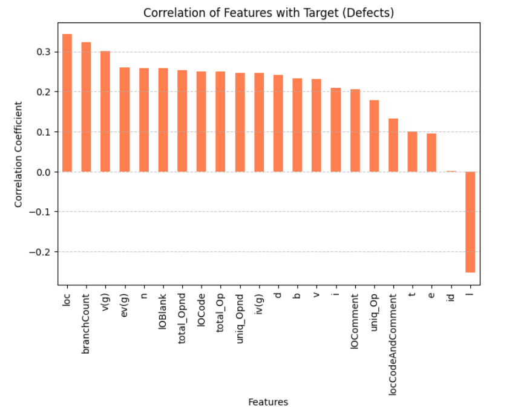
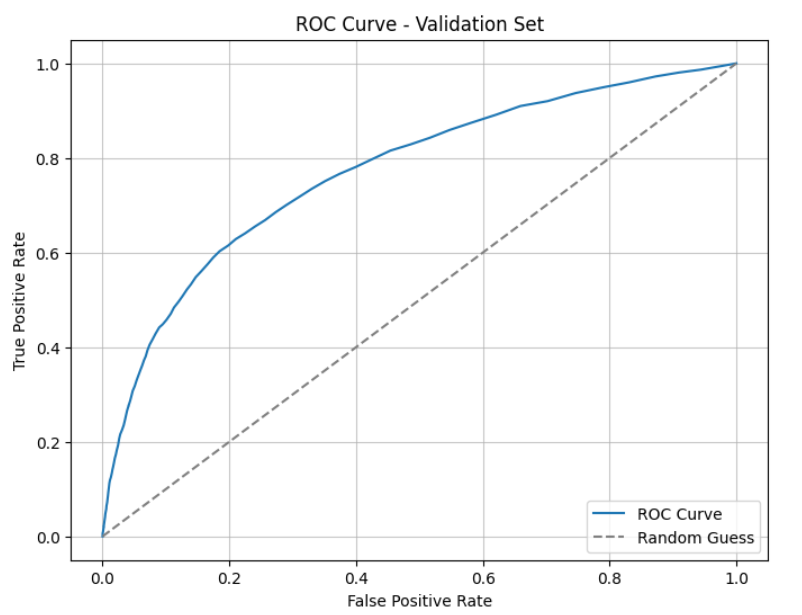

# Software Defects Prediction 

This repository holds an attempt to predict software defects using a binary classification dataset derived from the Software Defect Dataset. The work was completed as part of a Kaggle-style competition.

---

## Overview

The goal of this dataset project is to predict defects in software given various attributes about the code. The dataset consists of features like code complexity, branch counts, lines of code, and other properties of the code. This is a binary classification task, so the approach to handling this problem was using a Random Forest model.

Key Results:
- **Accuracy**: 81%
- **ROC-AUC**: 77%
- The model effectively distinguishes between defective and non-defective code, though improvements are possible for the minority class.

---

## Summary of Work Done

### Data

**Dataset Description**:
- **Source**: The dataset was generated from a deep learning model trained on the Software Defect Dataset.
- **Input**: Numerical and integer features describing software features.
- **Target**: Binary flag indicating the presence of defects (`True` or `False`).

**Instances**:
- **Training Data**: 101,763 samples
- **Test Data**: 67,842 samples
- **Validation Split**: 71,234 (train), 15,264 (validation), 15,265 (test)

**Preprocessing**:
- Identified and capped outliers in key features (`loc`, `branchCount`, `v(g)`, `ev(g)`, `n`).
- Standardized numerical features to ensure equal weight across the model.

**Data Visualization**:
- Histogram plots and boxplots were used to analyze feature distributions.
- Key correlated features with the target include `loc`, `branchCount`, and `v(g)`.

---

### Problem Formulation

**Input**: A set of numerical features describing software features.

**Output**: Probability of software defects (`True`).

**Model**:
- **Random Forest Classifier**: Selected for its ability to handle imbalanced datasets.

**Hyperparameters**:
- `n_estimators`: 100
- `class_weight`: Balanced to address class imbalance.

---

### Training

**Training Setup**:
- **Environment**: JupyterLab
- **Hardware**: Standard laptop with mediocre computational power.
- **Software**: Python, Scikit-learn, Matplotlib, Pandas.

**Training Details**:
- Training split into 70% train, 15% validation, and 15% test.
- Model performance tracked using accuracy and ROC-AUC.

**Challenges**:
- Addressing class imbalance in the target variable.
- Managing outliers effectively.

**Results**:
- **Accuracy**: 81%
- **ROC-AUC**: 77%

---

### Performance Comparison

| Metric        | Validation Set |
|---------------|----------------|
| Accuracy      | 81%         |
| ROC-AUC       | 77%         |
| Precision (True) | 64%          |
| Recall (True)   | 34%           |

 

---

### Conclusions

- Features like `loc` and `branchCount` are key predictors of software defects.
- Class imbalance affects recall for the minority class; perhaps techniques like Synthetic Minority Oversampling Technique (SMOTE) could help address this.
- Random Forest serves as an effective baseline model for handling this task.

---

### Future Work

- Implement techniques to address class imbalance, such as oversampling or SMOTE.
- Experiment with additional models like Gradient Boosting or Neural Networks.

---

## How to Reproduce Results

### Software Setup

**Required Packages**:
- Python 3.8+
- Pandas
- Matplotlib
- Scikit-learn
- Seaborn

1. Download the dataset from [Kaggle](https://www.kaggle.com/competitions/playground-series-s3e23/data)
2. Open up a JupyterLab environment in Python3 and install all the necessary packages
3. Upload test.csv and train.csv in the runtime environment.
4. Load the dataframes as train_data and test_data.
5. All code is commented on how it works, so use the completed cells in SoftwareDefectsProject.ipynb to reproduce results.

### Citations
- [Software Defects Dataset](https://www.kaggle.com/competitions/playground-series-s3e23/data)
- [Scikit-learn Documentation](https://scikit-learn.org)
